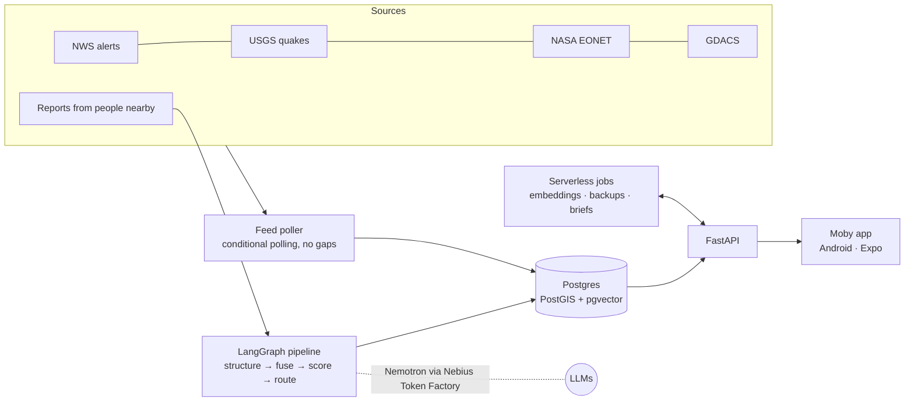

<div align="center">

# Moby — early warnings that reach you

**An open-source disaster early-warning app for people in places where official alerts don't reach.**
Moby combines official hazard feeds with reports from people on the ground, decides carefully what's
worth an alert, and helps you know what to do — even with little or no signal.

[](LICENSE)


[](https://github.com/sponsors/Xlient)

</div>

> ⚠️ **Moby complements official warning systems — it does not replace them.** Always follow
> instructions from local authorities and emergency services.

---

## Why

Floods, wildfires, landslides and storms are most dangerous exactly where warnings struggle to
arrive: trekking routes, valleys, rural areas, places where towers fail first. Often the earliest
signal is a person who sees the water rising. Moby is built for that moment:

- **Watches official sources for you** — the US National Weather Service, USGS earthquakes,
  NASA EONET and GDACS — continuously, and shows only what's near you.
- **Treats trust as a first-class feature.** An agency warning, a report confirmed by several people
  nearby, and a single unverified report always look different. A rumour should never look like a
  government warning.
- **Stays calm until it matters.** Quiet by default; loud only for real hazards. Critical alerts
  near you always get through, whatever your settings.
- **Works offline.** Last-known alerts, maps and (soon) safety guidance stay on your phone.

## Features

| | Status |
|---|---|
| Live official alerts (NWS, USGS, NASA EONET, GDACS), normalized and de-duplicated | ✅ |
| "Alerts near you" with a radius you choose, list and map always in agreement | ✅ |
| Clear trust levels: official · confirmed by people nearby · unverified | ✅ |
| Per-user alert types (hazards, minimum severity, marine) — critical alerts always shown | ✅ |
| Sign-in with email or Google; settings and watched areas synced to your account | ✅ |
| Google Maps with a drawn-map fallback when tiles can't load | ✅ |
| AI pipeline that fuses reports with official data (LangGraph + Nemotron) | 🚧 in progress |
| Community hazard reports with human review before anything goes public | 🚧 in progress |
| Push notifications and AI situational briefs | 🗓 planned |
| Offline safety guidance, on-device assistant, Bluetooth mesh relay | 🗓 planned |

## How it works



- **Backend** (`moby/`): Python 3.14, FastAPI, LangGraph, psycopg. Official feeds are polled with
  ETag / If-Modified-Since, normalized into one event schema, and linked across updates (an NWS
  alert and its updates stay one event). Urgency decisions are deterministic; models help structure
  and match reports, and a human approves before any community report becomes a public alert.
- **Models**: NVIDIA Nemotron 3 (Nano, Super, Ultra) and Qwen3 embeddings, served by
  [Nebius Token Factory](https://nebius.com/).
- **Data**: Postgres 17 with PostGIS (where things are) and pgvector (what they're about).
- **App**: Expo / React Native with React Native Paper, Firebase Auth + Firestore for accounts.
- **Hosting**: one [Nebius](https://nebius.com/) Serverless Endpoint runs the API, poller and
  database; Nebius Serverless Jobs handle background work (embeddings, backups).

## Quick start

### Backend (API, feed poller, database)

Requires Docker and [uv](https://docs.astral.sh/uv/).

```bash
git clone https://github.com/Xlient/Moby.git && cd Moby
cp .env.example .env                 # add your Nebius Token Factory key (only needed for AI features)
docker compose up -d --build         # Postgres + PostGIS + pgvector, migrations, live feed poller
uv sync
uv run --env-file .env uvicorn moby.api.app:app --reload
```

Then try it — active alerts within 100 km of San Francisco:

```bash
curl "http://localhost:8000/v1/alerts?lat=37.77&lon=-122.42&radius_km=100"
```

Run the tests with `uv run --env-file .env pytest`.

### Android app

The app lives on the `expo-android` branch while it's being merged. Requires Node.js, Android Studio
(SDK + an emulator) and **JDK 17**.

```bash
git switch expo-android
npm install
cp .env.example .env                 # Firebase + Google Maps settings; leave blank to run on mock data
npx expo run:android
```

With no backend or Firebase configured, the app runs on built-in sample alerts so you can explore it
immediately.

## Project status

Moby is being built in the open for a competition submission, in sprints: data layer and app
foundations are done; the agentic fusion pipeline, community reports with human review, and
notifications are in progress. Feature flags keep anything unfinished switched off in the app.

## Support Moby

Moby is free and open source, built by one independent developer. If it's useful to you, or you
want early warnings to reach more people, please consider
[sponsoring the project on GitHub](https://github.com/sponsors/Xlient).

Sponsorship pays for:

- **Keeping alerts running.** Hosting, the database and AI processing cost about $50 a month.
- **Development time.** It goes towards Bluetooth mesh relay (warnings that spread with no signal),
  more regions, and offline safety guidance.

Sponsors are thanked in this README. Moby complements official warning systems; it does not
replace them, and sponsorship doesn't change that.

## Contributing

Issues and pull requests are welcome. Please keep two principles intact in any change:

1. **Trust stays visible.** Unverified reports must never look like official warnings.
2. **Never a false all-clear.** If the app can't check, it says so — it never shows "all quiet".

Run the tests before opening a PR (`uv run pytest` for the backend, `npx tsc --noEmit` for the app).

## Data sources & acknowledgements

Hazard data comes from the [US National Weather Service](https://www.weather.gov/documentation/services-web-api),
the [USGS Earthquake Hazards Program](https://earthquake.usgs.gov/earthquakes/feed/),
[NASA EONET](https://eonet.gsfc.nasa.gov/) and [GDACS](https://www.gdacs.org/). These organisations
do not endorse Moby; their data is used under their public terms. Models are served by Nebius Token
Factory; NVIDIA Nemotron and Qwen models are the work of their respective authors.

## License

Moby is free software, licensed under the [GNU General Public License v3.0](LICENSE): you may use,
study, share and modify it, and distributed versions must remain open under the same license.
